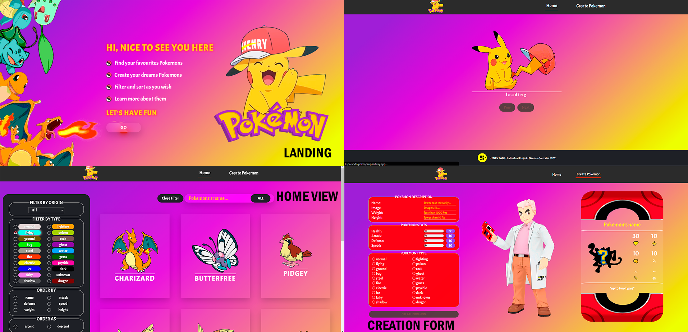
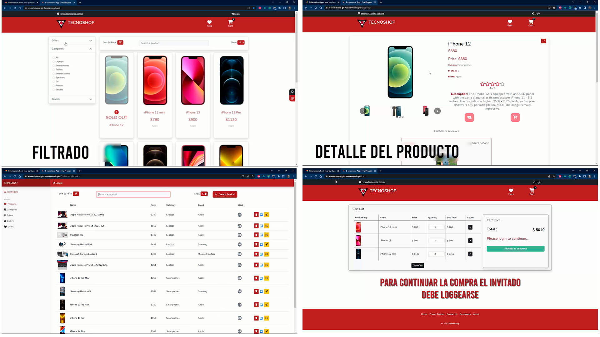

#lifelongLearning

## 😍Languages and tools

- HTML, CSS, Javascript, React, Redux, Node, Express, postgresSQL, Sequelize

## 😏About me

Soy desarrollador web, puedo desempeñarme como Front-end engineer,  
Back-end engineer o Fullstack (seniority level junior advanced),  
actualmente utilizo el stack PERN para realizar proyectos que sean  
escalables y modularizables. Poseo conocimientos en tecnologías como  
HTML, CSS, Javascript, React, Node, express, postgresSQL y sequelize. 

Soy proactivo, tenaz y comprometido, me encantan los entornos de desarrollo  
cooperativos y de trabajo en equipo utilizando metodologías ágiles como scrum.  
Tengo background en Contabilidad y Administración y me apasiona la tecnología.  
Poseo un Sólido manejo del inglés tanto oral como escrito (C2 Proficient  
Marco Común Europeo de Referencia para las lenguas).

Puedes contactarme escribiéndome a:
nangonz91@gmail.com

## 📎My Projects
- ## Pokémon SPA: https://pokemons-spa.vercel.app/  

 

- ## Tecnoshop e-commerce: https://e-commerce-pf-henna.vercel.app/

## ➕More info
- 🔭 I’m currently working on a web development project related to an eCommerce...
- 🌱 I’m currently learning Typescript and React Native...
- 👯 I’m looking to collaborate on web development projects...
- 📫 How to reach me: nangonz91@gmail.com...
- 😄 Pronouns: He/Him

## How to reach me
https://www.linkedin.com/in/dami-gonzalez/
 
nangonz91@gmail.com