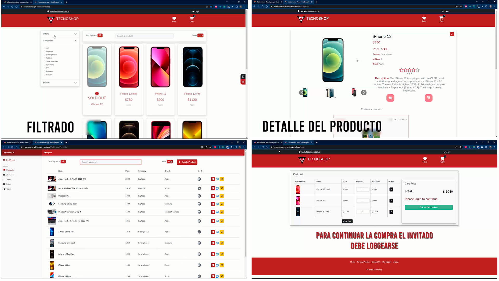
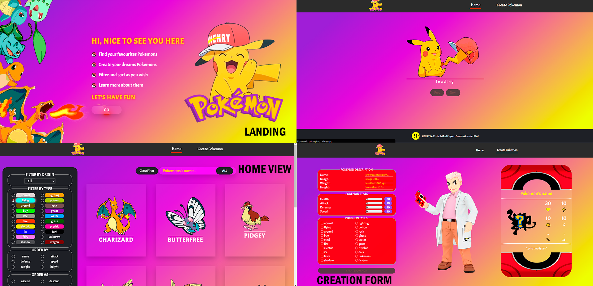

 

<!-- Social Media Links -->

## What i'm up to

- 🔭 I’m currently working @ [La Nueva Jerusalén](https://www.lanuevajerusalenamorysalvacion.com).
- 🌱 I’m currently working with [React](https://reactjs.org).
- 💬 Visit my personal portfolio [My personal website](https://damian-gonzalez.vercel.app)

 

 
 

---

---

<!-- Important Projects SECTION -->

    
<h2>💻 Projects I've worked in</h2>

    <h1>Tecnoshop e-commerce App </h1>
    

        
        
    

        

            
<h3>Description</h3>

            
Agile development team with one week sprints presenting to a Product Owner progress on the <strong>development of a complete E-commerce app</strong> with design and development of basic ecommerce features (CRUD of products, auth, catalog, checkout, etc..).
  
    
    <h1>Pokemon Single Page Aplication</h1>
    

        
        
    

    

        
<h3>Description</h3>

        
Development of a Single Page Aplication on React, Redux, NodeJS, ExpressJS, Sequelize with <strong>search</strong>, <strong>filtering</strong>, <strong>sorting</strong> and <strong>resource creation</strong>.

    
  
    

