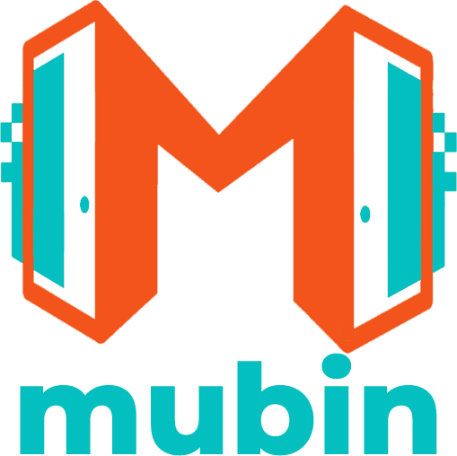
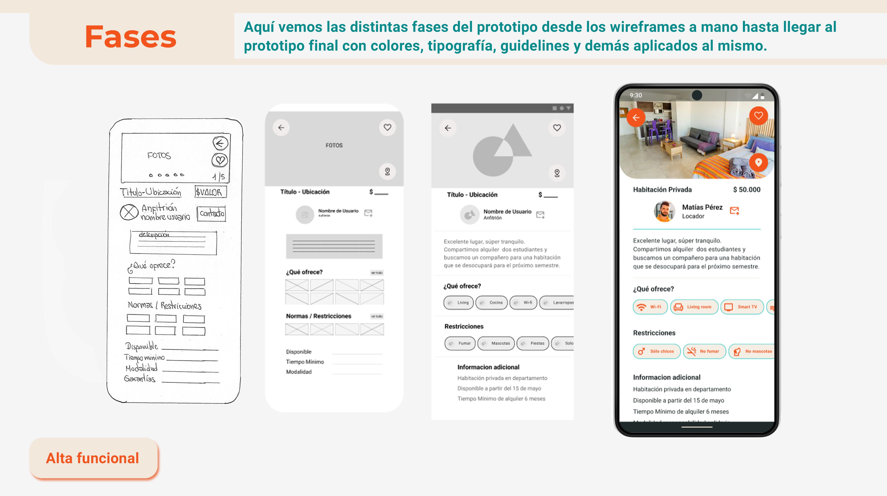

 
<!-- Social Media Links -->

    
    
    

<!-- Tech Skills, Frameworks and Libraries SECTION-->
<!-- 

    
<h2>😍 Skills Técnicas, Frameworks y Librerias</h2>

    
    
<h3>HTML, CSS, Javascript, React, Redux, Node, Express, postgresSQL, Sequelize</h3>

 -->

<!-- About me SECTION -->

    
<h2>ABOUT ME</h2>

    
👋🏻Hi! I'm Damian, Javascript Frontend Developer with knowledge in React, Redux, Node, Express, PostgreSQL, Sequelize. I recently completed a UX UI design program through the "Codo a Codo" initiative by the lifelong learning agency of the Ministry of Education of the Autonomous City of Buenos Aires. 
    
I've been part of multicultural work teams which has allowed me to develop communication and teamwork skills participating in the frontend and backend development of web applications implementing an agile work methodology. This helped me to increase my results orientation and problem solving skills.

    
My goal is to develop my professional career as a web developer and continue to grow 
    both personally and professionally to achieve the best possible results. If you want to know more about me, you can contact me on LinkedIn

    

    
👋🏻¡Hola! Soy Damian, Desarrollador Web Frontend Javascript. Estudié diseño UX UI en el programa "codo a codo" de la Agencia de aprendizaje a lo largo de la vida del MInisterio de Educación de la Ciudad Autónoma de Buenos Aires.

    
Durante mi formación he sido parte de equipos de trabajo multiculturales donde pude desarrollar habilidades de comunicación y de trabajo en equipo participando en el desarrollo frontend y backend de aplicaciones web implementando una metodología de trabajo ágil. Esto me ha permitido aumentar mi orientación a resultados y capacidad de resolución de problemas.

    
Mi objetivo es desarrollar mi carrera profesional como programador web y seguir creciendo tanto personal como profesionalmente para lograr los mejores resultados posibles. Si quieres saber más sobre mí, puedes contactarme a través de LinkedIn

    

    

<!-- Important Projects SECTION -->

    
<h2>💼 PROJECTS</h2>

    <h2>1. Tecnoshop e-commerce App </h2>
    

        
        
    

        

            
<h3>Description</h3>

            
Agile development team with one week sprints presenting to a Product Owner progress on the <strong>development of a complete E-commerce app</strong> with design and development of basic ecommerce features (CRUD of products, auth, catalog, checkout, etc..).

            <ul>
                <li>Payment gateway integration (Mercado Pago). </li>
                <li>Sending transactional emails (nodemailer). </li>
                <li>Administration of shopping cart and product orders. </li>
                <li>User administration, password management.  </li>
            </ul>
        
    
    
    

    <h2>2. Pokemon Single Page Aplication</h2>
    

        
        
    

    

        
<h3>Description</h3>

        
Development of a Single Page Aplication on React, Redux, NodeJS, ExpressJS, Sequelize with <strong>search</strong>, <strong>filtering</strong>, <strong>sorting</strong> and <strong>resource creation</strong>.

    
  
    
    

    <h2>3. Mubin</h2>
    

        
    

    

        
<h3>Description</h3>

        
Figma's prototype

    
  
    

