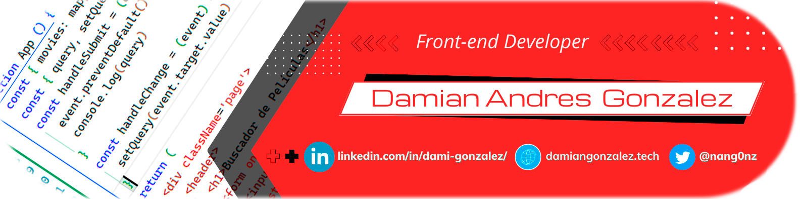

#lifelongLearning

<!-- Tech Skills, Frameworks and Libraries SECTION-->

    
<h2>😠Skills Técnicas, Frameworks y Librerias</h2>

    
    
<h3>HTML, CSS, Javascript, React, Redux, Node, Express, postgresSQL, Sequelize</h3>

<!-- Important Projects SECTION -->

    
<h2>💼 Important Projects</h2>

    <a href='https://www.youtube.com/watch?v=UWWrFgAO3vo' target='_blank'><h2>Tecnoshop e-commerce App </h2></a>
        

            
<h3>Description</h3>

            
Agile development team with one week sprints presenting to a Product Owner progress on the <strong>development of a complete E-commerce app</strong> with design and development of basic ecommerce features (CRUD of products, auth, catalog, checkout, etc..).

            <ul>
                <li>Payment gateway integration (Mercado Pago). </li>
                <li>Sending transactional emails (nodemailer). </li>
                <li>Management and sending of newsletters.  </li>
                <li>Administration of shopping cart and product orders. </li>
                <li>User administration, password management.  </li>
                <li>Coordinate project execution through Scrum implementation.  </li>
            </ul>
        
    
    
    <a href='https://www.youtube.com/watch?v=KTQ11pD6yeg' target='_blank'><h2>Pokemon Single Page Aplication</h2></a>
    

        
<h3>Description</h3>

        
Development of a Single Page Aplication on React, Redux, NodeJS, ExpressJS, Sequelize with <strong>search</strong>, <strong>filtering</strong>, <strong>sorting</strong> and <strong>resource creation</strong>.

    
  
    

<!-- About me SECTION -->

    
<h2>🧑🻠Sobre mí / About me</h2>

👋🏻¡Hola! <strong>Soy Damian, Desarrollador Frontend y estudiante
de diseño UX/UI</strong> con conocimientos en <em>Javascript, HTML5, CSS, React, Redux, 
Node, Express, PostgreSQL, Sequelize</em>. Durante mi formación he sido parte de equipos de trabajo multiculturales
donde pude desarrollar <strong>habilidades de comunicación</strong> y de <strong>trabajo en equipo</strong>
participando en el desarrollo frontend y backend de aplicaciones web
implementando una metodología de trabajo ágil con sprints de una
semana. Esto me ha permitido aumentar mi <strong>orientación a resultados</strong> y <strong>capacidad
de resolucion de problemas</strong>.

<strong>Puedes contactarme escribiéndome a:  
nangonz91@gmail.com</strong>

👋🏻Hi! <strong>I'm Damian, Fullstack Developer and UX/UI design student</strong>
<em>with knowledge in Javascript, HTML5, CSS, React, Redux, Node, 
Express, PostgreSQL, Sequelize.</em> I've been part of multicultural work teams which has allowed me to develop <strong>communication</strong> and <strong>teamwork skills</strong> participating in the frontend and backend development of web applications implementing an agile work methodology with one-week sprints. This helped me to increase my <strong>results orientation</strong> and <strong>problem solving skills</strong>.

<strong>You can contact me on LinkedIn or send me an email to:  
nangonz91@gmail.com</strong>
 

